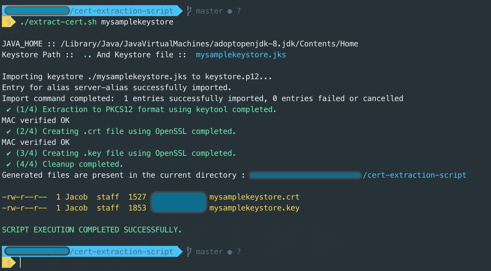
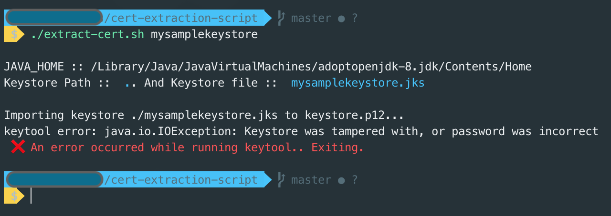

# cert-extraction-script

Script to extract .crt and .key files from a .jks file.

This script was tested with a mac and with slight modifications on a windows machine using git-bash. It should work in unix like environments like Linux or Mac with minimal path corrections in the CONFIGURATION section

Usage: In a terminal window ==> 
`./extract-cert.sh mysamplekeystore`

## Configuration

Configuration used by the script is present in the "------- CONFIGURATION -------" section of the script.

`PATH` : The directory path in which the .jks file is residing. The reason this is put as a config item rather than an input argument is because, typically this directory remains same in a given machine. So once this is configured in the script, there is no need to pass it each time you run this script to generate cert files from various .jks files.

`STOREPASS` : The password to be used to access the .jks file.

`GIT_PATH` : Path where Git is installed (where git binary is available). This especially needed in the case of windows, where certain tools used are part of the git installation (eg. openssl, rm, ls etc.)

## Dependencies

This script depends on following

- JDK
- JAVA_HOME     - environment variable with the path wehere JAVA is installed.
- keytool       - Present as part of JDK under JAVA_HOME/bin/
- GIT           - All unix commands used in the script are available as part of this Git installation. This is mostly needed to run in Windows
- Git Bash      - To execute this script in a windows machine.

## Testing
Command to create a sample .jks file for testing purposes

`keytool -genkey -alias server-alias -keyalg RSA -keypass changeit -storepass changeit -keystore mysamplekeystore.jks`

execute `./extract-cert.sh mysamplekeystore`

## Screenshot : Successfull execution

## Screenshot : Error in execution

